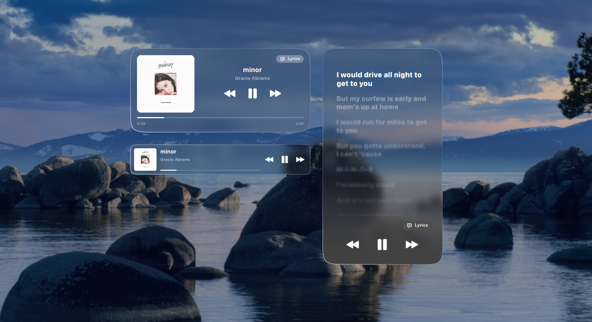
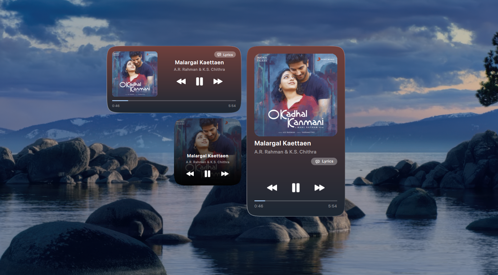

<div align="center">

<a href="https://www.youtube.com/watch?v=POa255JazMo">
  
</a>

# Liquid Glass — macOS Widgets for KDE

<i>v1.0</i><br>
macOS&nbsp;Tahoe / iOS-style liquid-glass widgets for KDE Plasma 6.<br><br>

<a href="https://github.com/jaxparrow07/liquidglass-kde-widgets/releases/latest">
  
</a>
<a href="https://ko-fi.com/devrinth">
  
</a>

</div>

---

An extensive widget set inspired from the latest MacOS (tahoe), along with liquid glass effect. Rather than taking the control away from the user, the widget offers all the parameters to be congfigured so you can basically customize EVERYTHING. The background for the widget is a custom shader, and even the solid modes are rendered by the shader since it supports gradients as well. If you want to make the custom styling consistent across your other widgets, you can simply copy and paste the widget style onto the other widgets.

**Note: For use with video wallpapers, enable continuous sampling of background in the config (extra battery drain)** 

## Widgets

### Clocks


### World / City clocks


DST-correct per-zone time, half-hour offsets handled.

### Music




Now-playing controls for whatever's playing on your system (MPRIS). **Supports synced lyrics via LRCLIB**, and adapts between wide and tall-wide layouts.
as you resize it. **You gotta check the next/previous song album flip, it took me several hours to get it right :)**

### Weather


A better looking weather widget for your desktop. Auto colors based on the weather and time.
A compact **panel** variant is also available (see below).

### Calendar


Stretch the widget wide to see upcoming events fetched from your actual calendar.

> **Note:** the events side panel reads from KDE's calendar system (Akonadi). It needs a little
> one-time setup — see [Additional Setup → Calendar Events](#calendar-events-akonadi).

### Timer


A countdown timer with quick presets and a notification when time's up. Works on both the desktop and
the panel. I tried to make the animations 1:1 as much as possible despite the limiations QML has.

### Panel widgets


Several widgets ship a compact **panel** representation (e.g. Weather, Timer) that follows your
system theme, with the full view shown on click.

**NOTE: WEATHER ON PANEL IS A SEPARATE WIDGET NAMED "Weather (Panel)"**

---

## Installation

### Prerequisites

- KDE Plasma **6.x** and Qt **6.x**
- `kpackagetool6` (ships with Plasma), plus `jq` and `zip`
- `qsb` (from `qt6-base-dev-tools`) — **only** needed if you rebuild the shaders

Clone the repository:

```bash
git clone https://github.com/jaxparrow07/liquidglass-kde-widgets.git
cd liquidglass-kde-widgets
```


### Method 1 — Install script (recommended)

Install everything:

```bash
./install.sh --all        # or: ./install.sh -a
```

Or install a single widget by its package name:

```bash
./install.sh <package_name>
```

### Building shaders

Compiled `.qsb` shaders are committed, so you dont have to compile the shaders again. Rebuild them only if you've changed
a shader source:

```bash
./build-shaders.sh        # 1-common/components/shaders/*.frag -> *.qsb
```

Then install/package.


Available package names:

| Package | Widget |
|---|---|
| `calendar` | Calendar |
| `clock-analog` / `clock-analog-2` / `clock-analog-3` | Analog clocks I / II / III |
| `clock-digital` | Digital clock |
| `city-1` / `city-2` / `city-3` / `city-digital` | World / City clocks |
| `music` | Music player |
| `weather` | Weather |
| `weather-panel` | Weather (panel) |
| `timer` | Timer |

The install script restarts Plasma Shell for you on success.

### Method 2 — Install from file

Download the packaged widgets from the [releases page](https://github.com/jaxparrow07/liquidglass-kde-widgets/releases/latest)
and load them manually:

1. **Desktop** → Right Click → **Enter Edit Mode**
2. **Add Widget** → **Get Widgets** → **Install Widget From Local File**
3. Select the downloaded `.plasmoid` file

### Method 3 — Manual

```bash
kpackagetool6 --type=Plasma/Applet -i packages/<package_name>   # install
kpackagetool6 --type=Plasma/Applet -u packages/<package_name>   # update
killall plasmashell && kstart plasmashell                       # restart
```

---

## Translations & Contributing

Every user-facing string is translatable. To add a language, see the
[Translation Guide](translate/TRANSLATE.md).

Contributions are welcome — please open issues and pull requests on
[GitHub](https://github.com/jaxparrow07/liquidglass-kde-widgets).

---

## Additional Setup

### Calendar Events (Akonadi)

The Calendar widget's events side panel reads from KDE's calendar system.

1. The base calendar support (`plasma-workspace`) is always present on Plasma 6. To pull in
   events from your synced accounts (Nextcloud, Google, Outlook, …), install the PIM plugin:

   ```bash
   sudo apt install kpim6-kdepim-addons
   ```

   This also pulls in `kdepim-runtime` (the Akonadi server). Holiday and astronomical event
   plugins ship with Plasma and need nothing extra.

2. Add and sync your calendar sources in **Merkuro Calendar** or **KOrganizer** — the widget
   shows whatever Akonadi has already synced.

3. In the widget's settings, enable the calendar plugins (e.g. *pimevents*, *holidays*) and
   tick the collections you want to display.

Without this setup the side panel simply shows **"No upcoming events"**.

---

## Copyright & Attribution

The bundled **fonts and icons are sourced from Apple's design system** and are included for
**personal, non-commercial use only**. Do not use them for commercial purposes.

**Disclaimer:** this project is **not affiliated with, endorsed by, or sponsored by Apple Inc.**
All product names, logos and brands are property of their respective owners.

## AI Disclosure

Most parts of this project is AI-assisted / spec developed. THIS PROJECT IS NOT VIBE CODED. I've manually rewritten several parts of the project and tested these for countless hours for all edge cases. Obviously, this wasn't developed with a single prompt, but I won't say I did all the heavy lifting. Perhaps this is what developing has come to, just shipping and making things faster. Because, USING AI, this project has taken me close to two months, and it would've taken me atleast 3-4 months without it. I, as a college student wouldn't have put that much time into a hobby project. So, I suppose as long as what you ship doesn't cost real money or is not slop, it's fine... I guess.
